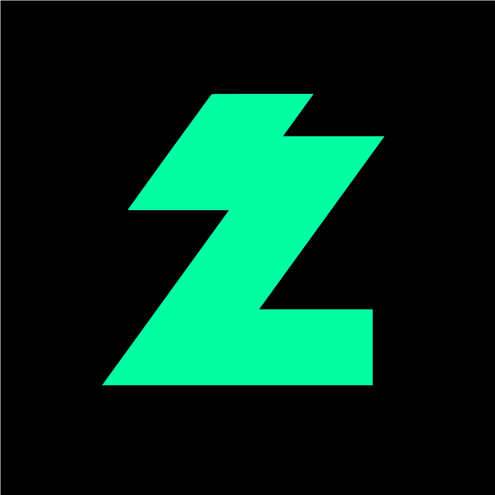

# 👨‍💻 DevOps 엔지니어

> 🚀 **직접 서버 및 네트워크를 구축하며, 클라이언트 맞춤형 서비스를 제공하는 아이곰입니다.**

- 🖥️ 자체 서버 및 네트워크 운영
- 🌐 Linux 기반 서버 구축 및 관리
-  스트리머 서버 개발 및 운영
- 📊 모니터링 및 장애 대응
-  자바 플러그인 개발

---

# 🛠️ 기술 스택

### 🖥️ 인프라

### ⚙️ DevOps

### 📊 모니터링

### 🗄️ 데이터베이스

### 💻 개발

---
# 🚀 주요 경험

<table>
<tr>
<td width="50%" valign="top">

### 🖥️ 자체 서버 및 네트워크 구축·운영

서버 구축부터 네트워크 구성, 운영 환경 관리까지 직접 설계

</td>

<td width="50%" valign="top">

### 🌐 네트워크 설계 및 관리

내부망 구성, 라우팅, 방화벽 정책 등 설계 및 운영

</td>
</tr>

<tr>
<td width="50%" valign="top">

###  스트리머 서버 개발 및 운영
 

- 라온 서버 - 총괄 운영 및 개발
  
 

- 조선야화2 - 운영 및 서브 개발
  
 

- 래토피아(시참서버) - 1인 개발 및 운영
  
 

</td>

<td width="50%" valign="top">

### 🧱 웹 서버 및 웹 방화벽 구축

웹 서버 구성 및 WAF 적용, 보안 정책 운영 관리

</td>
</tr>

<tr>
<td width="50%" valign="top">

### 📪 이메일 서비스 구축

이메일 서버 구축 및 도메인 관리 

</td>

<td width="50%" valign="top">

###  자바 플러그인 개발

사용자 요구사항에 따른 자체 플러그인 및 스크립트 제작
 
 

</td>
</tr>

</table>

### 그 외 

- 🔄 CI/CD 파이프라인 구축
- 📦 호스팅 서비스 구축
- 📊 모니터링 시스템 구축 및 로그 분석
- 🔒 서버 보안 및 유지보수

---

# 📫 연락처

