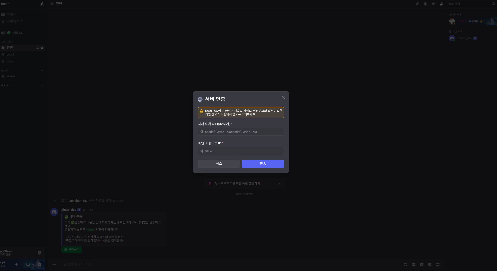
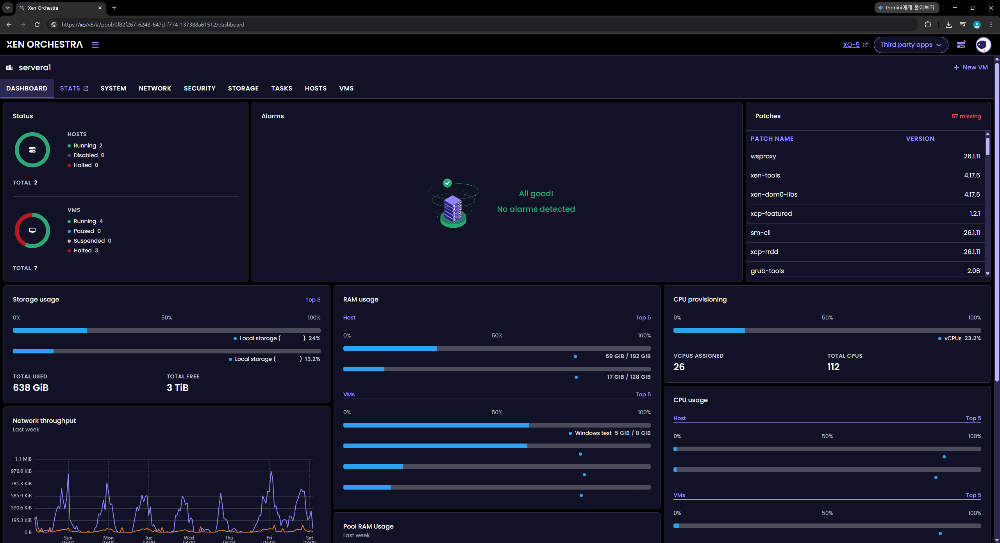
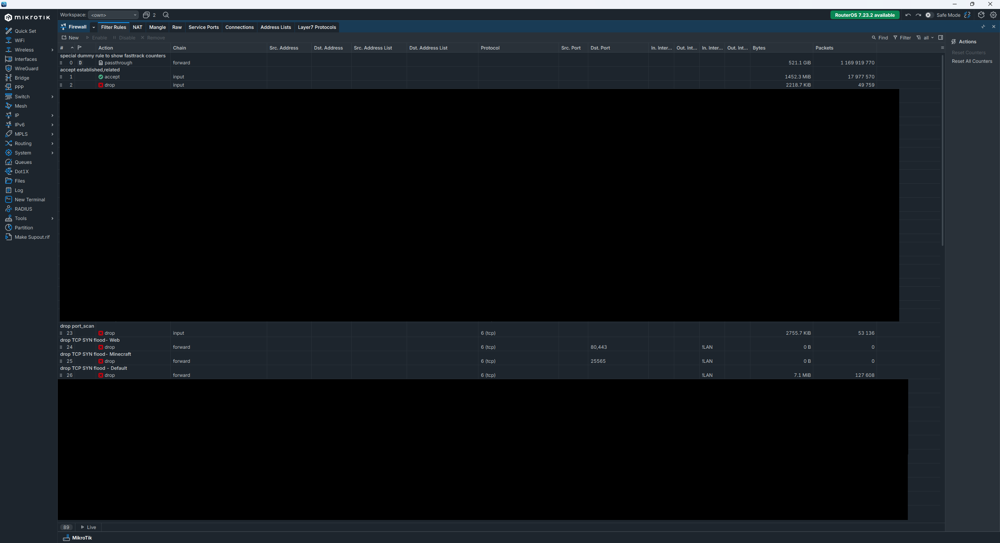
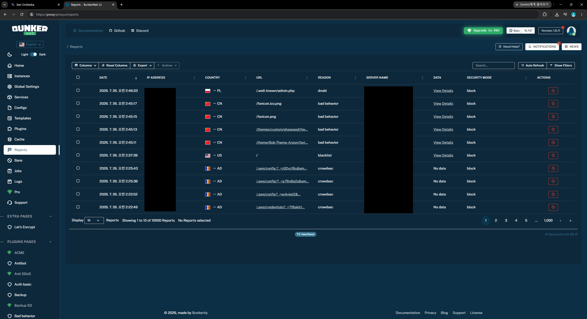
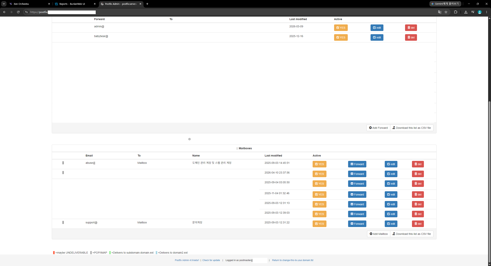

# 🐻 아이곰 · bbearDev

### 스트리머 전용 서버 · 서비스 구축 / 운영

**인프라 구축부터 운영, 플러그인 개발, 실시간 장애 대응까지 혼자 끝냅니다.** 
외주 업체 여러 곳에 나눠 맡길 일을 한 사람이 책임집니다.

---

## 💼 이런 걸 맡길 수 있습니다

| 영역 | 제공 범위 |
|---|---|
| 🎮 **스트리머 서버** | 합방·콘텐츠 서버 구축 · 시참 시스템 개발 · 실시간 운영 대응 |
| 🧩 **커스텀 콘텐츠 개발** | 방송 기획에 맞춘 플러그인 · 스크립트 제작 |
| 🚀 **런처 / 배포** | 커스텀 런처 제작, 스트리머들의 접속 진입장벽 최소화 |
| 🤖 **디스코드 자동화** | 인증 · 신청 · 관리 봇 개발 및 운영 |
| 🖥️ **인프라 일체** | 자체 서버 · 네트워크 · WAF · 메일 · 모니터링 직접 운용 |

> 💡 **자체 서버와 네트워크를 직접 보유·운영**하기 때문에, 호스팅 업체를 거치지 않고
> 사양 변경·긴급 증설·장애 대응을 즉시 처리할 수 있습니다.

---

## 🎮 스트리머 서버 운영 경험

<table>
<tr>
<td width="33%" valign="top">

## 라온 서버

**역할**: 총괄 운영 / 개발 
**규모**: 참여 스트리머 약 150명 
**기간**: 2024.09 ~ 2024.10

기획 단계부터 참여해 서버 구축, 콘텐츠 개발, 운영까지 전반을 총괄

</td>
<td width="33%" valign="top">

## 조선야화 2

**역할**: 운영 / 서브 개발 
**규모**: 참여 스트리머 약 80명 
**기간**: 2026.02 ~ 2026.03

서버 안정성 관리 및 콘텐츠 개발 지원, 실시간 대응

</td>
<td width="33%" valign="top">

## 래토피아 (시참 서버)

**역할**: 1인 개발 / 운영 
**규모**: 참여 시청자 약 30명 
**기간**: 2026.07 ~ 운영 중

시청자 참여 시스템을 단독 설계·개발 
인프라 구축부터 방송 중 실시간 대응까지 단독 수행

</td>
</tr>
</table>

---

## 🧩 제작물

<table>
<tr>
<td width="33%" valign="top">

##  자바 플러그인 개발

방송 기획에 맞춘 자체 플러그인 및 스크립트 제작
<!-- 여기에 플러그인 스크린샷 삽입 예정 -->

<a href="./project/plugins.md">
 

</a>

</td>
<td width="33%" valign="top">

##  디스코드 봇 개발

서버 인증 · 신청 · 관리 자동화 봇

</td>
<td width="33%" valign="top">

## 🚀 커스텀 런처 개발

헬리오스 기반 커스텀 런처 제작 
모드팩 자동 배포로 스트리머들의 접속 진입장벽 최소화

</td>
</tr>
</table>

---

## 🖥️ 인프라 운영 역량

<table>
<tr>
<td width="50%" valign="top">

## 자체 서버 및 가상화 운영

물리 서버 구축부터 가상화 환경 구성, 자원 배분까지 직접 설계

</td>
<td width="50%" valign="top">

## 네트워크 설계 및 관리

내부망 구성, 라우팅, 방화벽 정책 설계 및 운영

</td>
</tr>
<tr>
<td width="50%" valign="top">

## 웹 서버 및 웹 방화벽 (WAF)

웹 서버 구성 및 WAF 적용, 보안 정책 운영

</td>
<td width="50%" valign="top">

## 이메일 서비스 구축

자체 메일 서버 구축 및 도메인 관리 
브랜드 도메인 메일 발급 가능

</td>
</tr>
</table>

**그 외**: 호스팅 서비스 구축 · 모니터링 시스템 구축 및 로그 분석 · 서버 보안 및 상시 유지보수 · SSL 인증서 관리

---

## 🛠️ 기술 스택

**개발**

**인프라 / 가상화**

**운영 / 모니터링**

**데이터베이스**

---

## 📫 연락 주세요

프로젝트 문의 · 협업 제안 언제든 환영합니다. 
**디스코드 DM이 가장 빠릅니다.**

