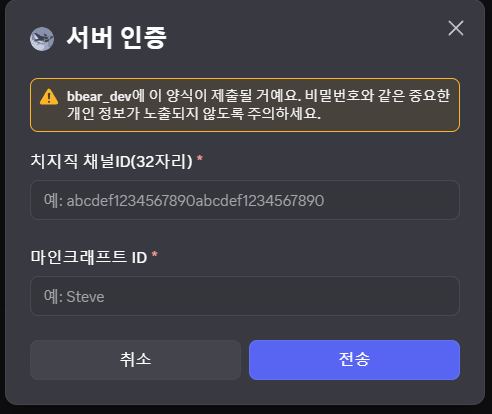
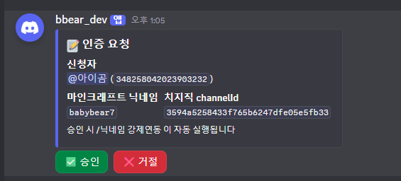
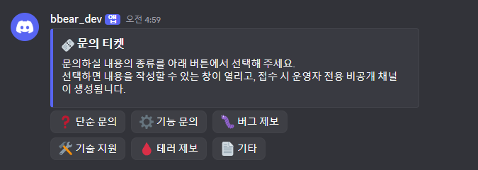
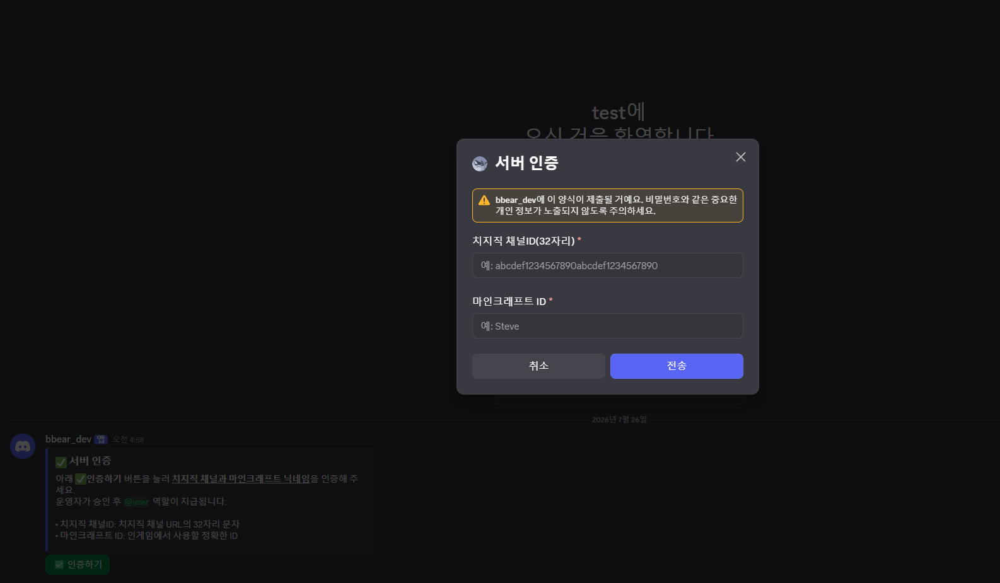
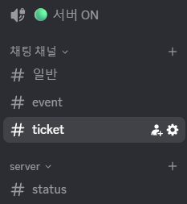
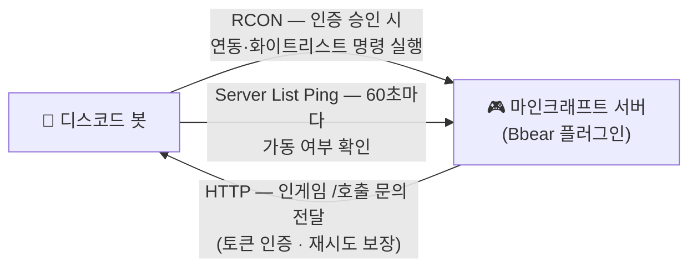

# 🤖 Bbear Discord Bot

> **마인크래프트 서버와 디스코드를 하나로 묶는 운영 봇**
> 
> 인증 한 번이면 서버 입장부터 자동 연동까지, 문의는 인게임에서도 디스코드에서도 같은 창구로 진행.

<p>
  
  
  
  
</p>

> 🐻 마인크래프트 서버 측 플러그인은 [**Bbear**](../bbearplugins/Bbear/PORTFOLIO.md)입니다. 이 봇은 그 플러그인과 짝을 이루어 동작합니다.

---

## 왜 필요한가요

스트리머 서버를 운영하면 늘 같은 일이 반복됩니다.

- 새로 온 스트리머가 **"저 어떻게 들어가요?"** 라고 물어봅니다 → 운영자가 닉네임 확인하고, 화이트리스트 넣고, 역할 주고, 플러그인에 채널 연동까지 손으로 합니다.
- 문의가 **DM·채팅·인게임**으로 흩어져서 놓칩니다.
- **"서버 언제 켜지나요? 서버 점검 언제인가요?"** 가 하루에도 몇 번씩 올라옵니다.

이 봇은 그 셋을 전부 자동화합니다. 운영자가 하는 일은 **승인 버튼 한 번**뿐입니다.

---

## 기능 한눈에 보기

| 기능 | 한 줄 소개 |
|:--|:--|
| **인증 → 자동 연동** | 치지직 채널 + 마크 닉네임 제출 → 운영자 승인 → 서버 입장 준비 완료 |
| **티켓 시스템** | 6개 카테고리 버튼 → 신청자와 운영자만 보이는 비공개 채널 자동 생성 |
| **인게임 문의 연동** | 마크에서 `/호출`로 남긴 문의가 디스코드에 **똑같은 티켓**으로 도착 |
| **서버 상태 표시** | 채널 이름이 실시간으로 `🟢 서버 ON` / `🟠 점검중` / `🔴 서버 OFF` 표기 |


[테스트 디스코드](https://discord.gg/6vkdG52aE7) 에서 **실제 봇**을 확인해볼 수 있습니다. 

---

## 주요 기능 자세히

### ✅ 인증 한 번으로 입장까지


| | |
|:--:|:--:|
| <br>인증 패널 | <br>운영자 승인 |
| <br>티켓 발급 패널 | <br>비공개 티켓 채널 |
| <br>인게임 `/호출` | <br>실시간 상태 채널 |


디스코드에 처음 들어오면 자동으로 **미인증** 역할이 붙습니다. `/인증`을 누르고 **치지직 채널 ID**와 **마인크래프트 닉네임**을 적어 제출하면, 운영자 채널에 승인 요청이 올라갑니다.

운영자가 **✅ 승인**을 누르는 순간 아래의 항목이 한번에 처리됩니다.

| | 자동 처리 내용 |
|:--:|:--|
| 1 | 마크 서버에 **치지직 채널 ↔ 마인크래프트 계정 연동** 등록 (RCON) |
| 2 | 서버 **화이트리스트에 자동 등록** |
| 3 | 디스코드 역할이 **미인증 → 시청자**로 교체 |
| 4 | 디스코드 별명이 **치지직 채널명과 동일하게** 변경 |

인증이 끝나면 인게임 채팅·이름표에 치지직 닉네임이 그대로 뜨고, 디스코드에서도 같은 이름으로 보입니다. **어디서 보든 같은 사람인 걸 알 수 있습니다.**

거절도 버튼 한 번이며, 사유와 함께 신청자에게 전달됩니다.

<br/>




---

### 🎫 티켓

<!-- 📸 티켓 패널(카테고리 버튼) + 생성된 비공개 채널 -->

티켓 패널에서 종류를 고르고 내용을 적으면, **신청자와 운영자만 보이는 채널**이 즉시 만들어집니다.

| | 카테고리 | | 카테고리 |
|:--:|:--|:--:|:--|
| ❓ | 단순 문의 | 🛠️ | 기술 지원 |
| ⚙️ | 기능 문의 | 🩸 | 테러 제보 |
| 🐛 | 버그 제보 | 📄 | 기타 |

채널 안에는 운영용 버튼이 함께 붙습니다:

- **🔒 닫기** — 신청자 접근을 막고 보관 상태로 전환
- **📄 대화 기록 생성** — 지금까지의 대화를 파일로 저장 (증거·회고용)
- **🗑️ 삭제** — 채널 제거 (실수 방지를 위해 **↩️ 삭제 취소** 확인 단계를 거칩니다)


---

### 🎮 인게임 `/호출` → 디스코드 티켓

<!-- 📸 인게임 /호출 화면 → 디스코드에 생성된 티켓 채널 -->

이 봇의 핵심입니다. 플레이어가 **게임을 하다가** 문의를 남길 수 있습니다.

마크에서 `/호출`(또는 `/문의`)을 치고 종류를 고른 뒤 내용을 적으면 → 디스코드에 **버튼으로 만든 것과 완전히 동일한 티켓 채널**이 생성됩니다.

- 인증을 마친 유저라면 **그 채널에 들어가** 운영자와 대화할 수 있습니다
- 아직 연동 전이라면 운영자 전용 채널로 만들어지고, 마크 닉네임이 라벨로 붙습니다
- **봇이 잠시 꺼져 있어도 문의가 사라지지 않습니다.** 마크 서버가 요청을 디스크에 먼저 저장한 뒤 보내고, 실패하면 다시 시도합니다. 중복 요청은 봇 쪽에서 걸러냅니다

> 운영자가 접속해 있지 않아도, 디스코드를 안 보고 있어도 문의는 반드시 남습니다.

---

### 📡 서버 상태 — 물어보지 않아도 보입니다


봇이 마크 서버를 주기적으로 확인해서 **채널 이름 자체를 상태판으로** 씁니다.

```
🟢 서버 ON
🟠 점검중
🔴 서버 OFF
```

- 디스코드 채널 목록 맨 위에 항상 떠 있어 **아무도 물어볼 필요가 없습니다**
- 서버가 켜지거나 꺼질 때마다 알림 채널에 공지합니다
- 점검 모드도 구분합니다 — 서버가 꺼진 것과 정비 중인 것은 다르게 표시됩니다
- 표시 채널을 미리 만들 필요 없이, 봇이 **채널을 자동 생성**합니다



---

## 명령어

| 명령어 | 권한 | 설명 |
|:--|:--|:--|
| `/인증` | 모두 | 인증 모달 열기 |
| `/인증패널` | 운영자 | 현재 채널에 인증 안내 패널 게시 |
| `/티켓패널` | 운영자 | 현재 채널에 티켓 발급 패널 게시 |

나머지는 전부 **버튼과 모달**로 처리됩니다. 유저가 외워야 할 명령어는 없습니다

---


## 기술 개요

<details>
<summary>펼쳐 보기</summary>

| 항목 | 값 |
|:--|:--|
| 언어 | Java 21 |
| 라이브러리 | JDA 5.2.1 (Discord) |
| 빌드 | Gradle (단일 실행 jar) |
| 구성 | 기능 모듈 4개 · 클래스 21개 · 약 2,900줄 |
| 테스트 | JUnit 5 |
| 실행 | systemd 서비스 상주 |
| 현재 버전 | v1.0.0 |

**설계 방향**

- **모듈 단위 격리** — 인증·티켓·상태·브리지가 각각 독립된 생명주기를 갖습니다. 브리지를 꺼도 나머지는 그대로 동작합니다
- **티켓 생성 경로 단일화** — 디스코드 버튼으로 만들든 인게임 `/호출`로 만들든 **같은 코드 경로**를 지납니다. 두 입구가 갈라져 동작이 달라지는 일이 없습니다
- **유실 없는 전달** — 인게임 문의는 마크 서버가 먼저 디스크에 기록한 뒤 전송하고, 실패 시 재시도합니다. 중복은 요청 ID로 봇이 제거합니다
- **설정 검증** — 토큰·비밀번호가 채워지지 않은 상태로는 기동을 거부합니다. 인증 없는 수신 포트가 열리는 일이 없습니다
- **rate-limit 존중** — 채널 이름 갱신처럼 디스코드가 제한하는 동작은 주기를 따로 두어 제한에 걸리지 않게 합니다
<br/>
<br/>
<br/>
<br/>


## 마인크래프트 서버와 이어지는 방식

봇과 게임 서버는 세 갈래로 연결됩니다.



| 경로 | 방향 | 쓰이는 곳 |
|:--|:--:|:--|
| **RCON** | 봇 → 마크 | 인증 승인 시 계정 연동·화이트리스트 등록 |
| **Server List Ping** | 봇 → 마크 | 서버 상태와 접속자 수 감지 |
| **HTTP 브리지** | 마크 → 봇 | 인게임 `/호출` 문의를 티켓으로 전달 |

문의 전달 경로는 **토큰 인증**을 쓰고, 토큰이 설정돼 있지 않으면 봇이 아예 수신을 열지 않습니다.


</details>


---

<p align="center">
  <sub>Bbear Discord Bot · 마인크래프트 서버 운영 자동화 · 제작 BabyBear76</sub>
</p>
